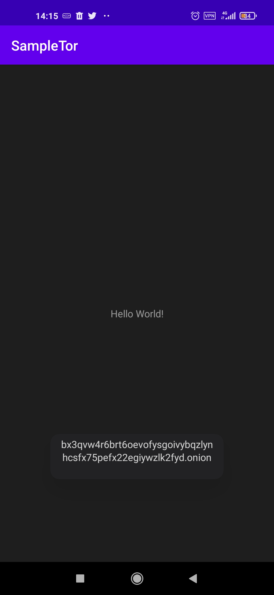

# Tor Android

YATLA (**Y**et **A**nother **T**or **L**ibrary for **A**ndroid) Version 2 

Tor Android is a library which included Tor binary inside it. Tor Binary is grabbed from [Guardian Project's maven](https://github.com/guardianproject/gpmaven/blob/master/org/torproject/tor-android-binary/). Some helper libraries added in order to make life easier. In the current version, 2 main features added including support for multiple hidden services, and ability to load former torrc file.


## Changelog

* Added Support for multiple Hidden Services
* Able to create a new torrc or load existed one

## How To Import

It is very simple. Just implement the following package in your application Gradle file:

```shell
implementation 'ir.mstajbakhsh:tor-android:2.0.0'

# Or Use JitPack

allprojects {
		repositories {
			...
			maven { url 'https://jitpack.io' }
		}
	}

dependencies {
	        implementation 'com.github.mirsamantajbakhsh:TorAndroid:2.0.0'
	}
```

## Code Example

The main configuration of the Tor Android is based on ```TorBuilder``` class. Here is a sample configuration for ```TorBuilder``` inside an Activity:

```java
        TorProxy tb = new TorProxy.TorBuilder(getApplicationContext())
                .setSOCKsPort(TOR_TRANSPROXY_PORT_DEFAULT) //9150 for example
                .setUseBrideges(false)
                .setExternalHiddenServicePort(80)
                .setInternalHiddenServicePort(80)
                .setDebuggable(false)
                .build();
        tb.init();
        try {
            tb.start(new IConnectionDone() {
                @Override
                public void onSuccess() {
                    Log.d("TorAndroid", "Tor started successfully.");
                }

                @Override
                public void onFailure(Exception ex) {
                    Log.e("TorAndroid", "Error in starting Tor.\r\n" + ex.getMessage());
                }
            });
        } catch (IOException e) {
            e.printStackTrace();
        }
```

In action version:


## Test On Real Device

```java
@Override
protected void onCreate(Bundle savedInstanceState) {
    super.onCreate(savedInstanceState);
    setContentView(R.layout.activity_main);

    AsyncTask.execute(new Runnable() {
        @Override
        public void run() {

            final TorProxy tb = new TorProxy.TorBuilder(getApplicationContext())
                    .setSOCKsPort(TOR_TRANSPROXY_PORT_DEFAULT) //9150 for example
                    .setUseBrideges(false)
                    .setExternalHiddenServicePort(80)
                    .setInternalHiddenServicePort(80)
                    .setDebuggable(false)
                    .build();
            tb.init();

            runOnUiThread(new Runnable() {
                @Override
                public void run() {
                    Toast.makeText(getApplicationContext(), "Initialized", Toast.LENGTH_LONG).show();
                }
            });


            try {
                tb.start(new IConnectionDone() {
                    @Override
                    public void onSuccess() {
                        Log.d("TorAndroid", "Tor started successfully.");
                        runOnUiThread(new Runnable() {
                            @Override
                            public void run() {
                                Toast.makeText(getApplicationContext(), "TOR is OK.", Toast.LENGTH_LONG).show();
                                Toast.makeText(getApplicationContext(), tb.getOnionAddress(), Toast.LENGTH_LONG).show();
                            }
                        });

                    }

                    @Override
                    public void onFailure(final Exception ex) {
                        Log.e("TorAndroid", "Error in starting Tor.\r\n" + ex.getMessage());
                        runOnUiThread(new Runnable() {
                            @Override
                            public void run() {
                                Toast.makeText(getApplicationContext(), "Error\r\n" + ex.getMessage(), Toast.LENGTH_LONG).show();
                            }
                        });
                    }
                });
            } catch (IOException e) {
                e.printStackTrace();
            }
        }
    });

}
```

Onion address generated by the TorAndroid:



# Donate

If you liked the project, buy me a cup of coffee:

BitCoin Wallet: ```1F5uiEmdCLJX5KktWHE1wkc63feKJYMmxS```

# Contact

You can reach me at my web site available at: https://mstajbakhsh.ir

