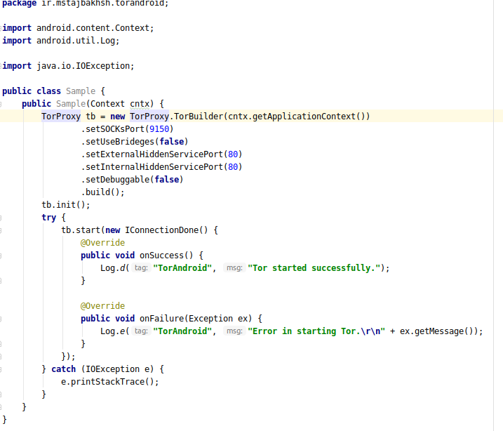

# Tor Android

Yet Another Tor Library for Android

Tor Android is a library which included Tor binary inside it. Tor Binary is grabbed from [Guardian Project's maven](https://github.com/guardianproject/gpmaven/blob/master/org/torproject/tor-android-binary/). Some helper libraries added in order to make life easier.

## How To Import

It is very simple. Just implement the following package in your application Gradle file:

```shell
implementation 'ir.mstajbakhsh.android:TorAndroid:1.0.0'
```

## Code Example

The main configuration of the Tor Android is based on ```TorBuilder``` class. Here is a sample configuration for ```TorBuilder``` inside an Activity:

```java
        TorProxy tb = new TorProxy.TorBuilder(getApplicationContext())
                .setSOCKsPort(TOR_TRANSPROXY_PORT_DEFAULT) //9150 for example
                .setUseBrideges(false)
                .setExternalHiddenServicePort(80)
                .setInternalHiddenServicePort(80)
                .setDebuggable(false)
                .build();
        tb.init();
        try {
            tb.start(new IConnectionDone() {
                @Override
                public void onSuccess() {
                    Log.d("TorAndroid", "Tor started successfully.");
                }

                @Override
                public void onFailure(Exception ex) {
                    Log.e("TorAndroid", "Error in starting Tor.\r\n" + ex.getMessage());
                }
            });
        } catch (IOException e) {
            e.printStackTrace();
        }
```

In action version:



# Donate

If you liked the project, buy me a cup of coffee:

BitCoin Wallet: ```1F5uiEmdCLJX5KktWHE1wkc63feKJYMmxS```

# Contact

You can reach me at my web site available at: https://mstajbakhsh.ir

